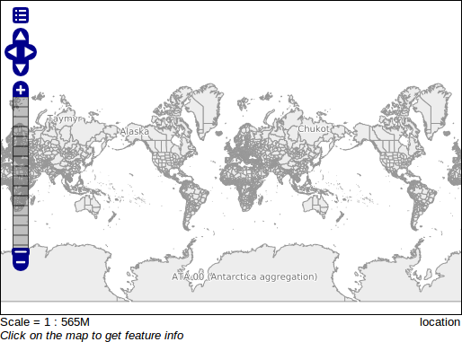

Katalogeinträge editieren
=========================

Neben dem Hinzufügen von Katalogressourcen ist der häufigste Anwendungsfall in der
Administration des GeoServers das Editieren bestehender Ressourcen. Selbstverständlich
kann uns auch hier die REST-API in wiederkehrenden Prozeduren zur Seite stehen.
Als Beispiel werden wir mit dem folgenden cURL das standardmäßige Ausgabeprojektionssystem
des Layers `states_provinces` zu EPSG:900913 ändern:

```bash
curl \
  -v \
  -u admin:geoserver \
  -XPUT \
  -H "Content-type: text/xml" \
  -d "<featureType>
        <enabled>true</enabled>
        <srs>EPSG:900913</srs>
        <projectionPolicy>REPROJECT_TO_DECLARED</projectionPolicy>
      </featureType>" \
  {{ book.geoServerBaseUrl }}/rest/workspaces/fossgis/datastores/natural_earth/featuretypes/states_provinces
```

Nachdem dieser Schritt mit `HTTP/1.1 200 OK` bestätigt wurde, können wir anschließend
automatisch über REST die neue native Bounding Box des Layers mit dem Parameter
recalculate=nativebbox,latlonbbox berechnen lassen:

```bash
curl \
  -v \
  -u admin:geoserver \
  -XPUT \
  -H "Content-type: text/xml" \
  -d "<featureType>
        <enabled>true</enabled>
      </featureType>" \
  {{ book.geoServerBaseUrl }}/rest/workspaces/fossgis/datastores/natural_earth/featuretypes/states_provinces?recalculate=nativebbox,latlonbbox
```

Betrachten wir nun den Layer in der Layerübersicht des GeoServers ()
sehen wir, dass der Layer - wie zu erwarten - mit dem angegebenen Koordinatensystem
EPSG:900913 und einer Bounding Box im entsprechenden Koordinatensystem konfiguriert
ist:


Das Ergebnis unserer Änderung können wir uns abschließend über die GeoServer Layervorschau () anschaulich illustrieren lassen:



**Wichtiger Hinweis**: Das REST-Paradigma beschreibt, dass Repräsentationen (hier
    in den Formaten `XML` und `JSON`) sowohl gelesen als auch geschrieben werden
    können. Dies bedeutet, dass jede XML-Antwort (siehe z.B. Layer anlegen \<rest\_create\_layer\>)
    in der obigen Form abgeändert (z.B. mit neuem Layernamen oder als deaktiviert
        markiert) und direkt über die REST-API an den Server gesendet werden kann.

Nachdem wir bestehende Ressourcen editiert haben, wird das [letzte Kapitel](delete.md)
dieses Moduls erläutern, wie Sie Ressourcen entfernen können.
