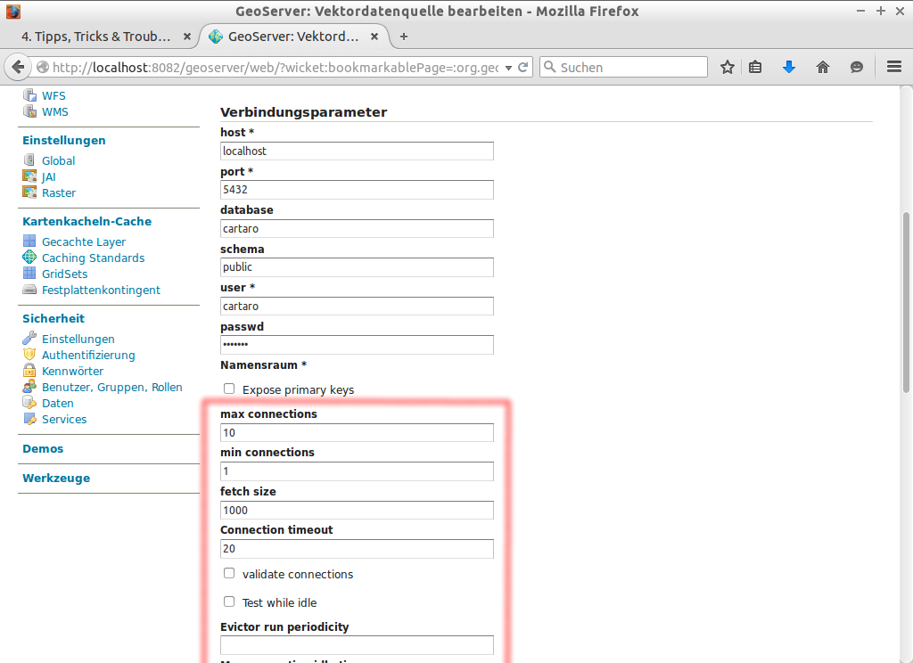

Einstellungen in der GeoServer GUI
==================================

Es gibt zahlreiche Möglichkeiten den GeoServer über die Weboberfläche zu
konfigurieren. Wir wollen in diesem Abschnitt kurz auf hilfreiche Optionen hinweisen:

* **Vektordaten aus Datenbanken**: Bei Datenbank-Quellen, die sehr viele (z.B.
  mehrere Millionen) Features enthalten, können die Verbindungsparameter (für
  den Datenbankzugriff) einen entscheidenden Einfluss auf die Performance des
  GeoServers haben. Details zu den Parametern finden Sie [hier](http://docs.geoserver.org/stable/en/user/data/database/connection-pooling.html).

* Der GeoServer verwendet die **Java Advanced Imaging (JAI)**-Bibliothek zur
  Bildmanipulation (z.B. zum Erzeugen der Kacheln, die ausgeliefert werden). Im
  Bereich *JAI* der Weboberfläche können verschiedene Parameter eingestellt werden,
  die [hier](http://docs.geoserver.org/maintain/en/user/webadmin/server/JAI.html)
  dokumentiert sind.
* Wenn Sie über den GeoServer **sehr viele** verschiedene (Vektor-)Layer bereitstellen,
  sollte der Wert **Größe des Feature Type Caches** mindestens so groß sein wie
  die Anzahl der bereitgestellten Feature Types. Ansonsten kann es zwischenzeitlich
  zu spürbar längeren Antwortzeiten bei WFS-Anfragen kommen. Der Wert kann in
  der Weboberfläche im Bereich *Einstellungen -\> Global* konfiguriert werden.
* Sollten Sie einen öffentlich zugänglichen GeoServer verwalten, ist es dringend
  zu empfehlen, dass sie **WFS-T(ransaktionen) ausstellen**, falls diese schreibende
  Funktionalität nicht erlaubt ist bzw. benötigt wird. Dazu müssen Sie den
  Radio-Button im Bereich *Dienste -\> WFS -\> Dienstgüte* von "Vollständig" auf
  "Basis" wechseln. Anderenfalls wäre es denkbar, dass Ihre Daten unerwünscht
  per WFS-T von Dritten manipuliert werden.
* Sehr hilfreich kann das Anlegen von **SQL-Views** (auf Ebene des Geoservers und
  nicht der Datenbank(!)) sein. Diese Funktionalität erreichen Sie, wenn Sie
  im Bereich *Daten -\> Layer -\> Layer hinzufügen* eine Vektor-Datenbankquelle
  auswählen und dort *SQL View konfigurieren* klicken. Nützlich ist insbesondere
  die Möglichkeit die SQL-Views zu parametrisieren, etwa um bestimmte Features
  durch entsprechende Parameter herauszufilter. Ausführliche Informationen
  dazu finden Sie [hier](http://docs.geoserver.org/stable/en/user/data/database/sqlview.html).

Der letzte [Abschnitt](jvm.md) zeigt wie Sie die *Java Virtual Machine (JVM)* für
den GeoServer tunen können.
